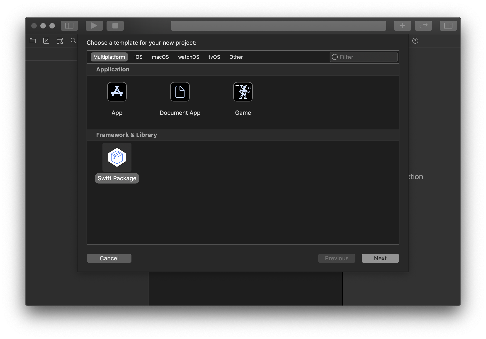
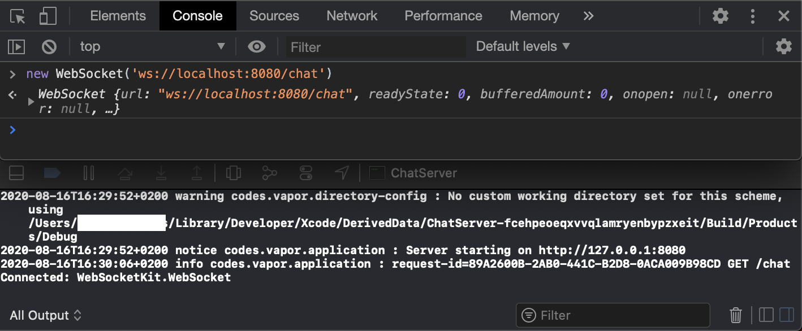
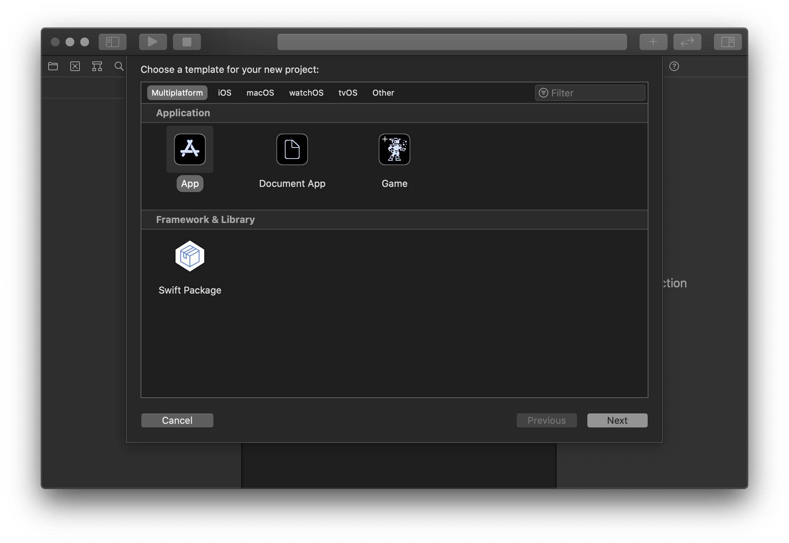
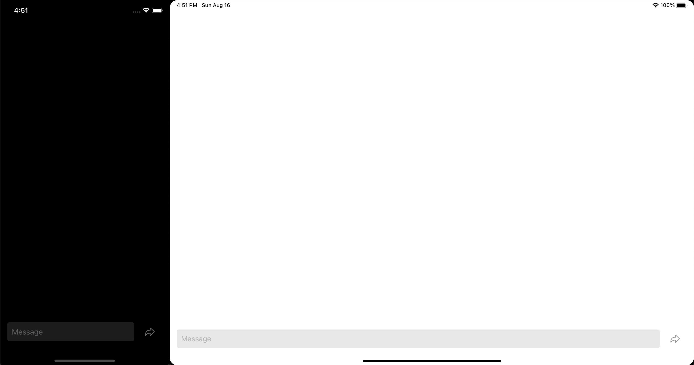

# A simple chat app with SwiftUI and WebSockets - or: Swift in the back, Swift in the front!
> Creating a very primitive chat app in SwiftUI, while using Swift and WebSockets to create the chat server. It's Swift all the way down!

## Index
* [Introduction](#introduction)
	* [Quick summary of what's to come](#quick-summary-of-whats-to-come)
	* [Requirements](#requirements)
* [Creating the server](#creating-the-server)
	* [Setup Package.swift](#setup-package.swift)
	* [Writing some actual code](#writing-some-actual-code)
* [Creating the app](#creating-the-app)
	* [Connecting to the server](#connecting-to-the-server)
	* [Testing disconnection](#testing-disconnection)
* [Sending messages](#sending-messages)
	* [Server-side](#server-side)
	* [Client-side](#app-side)
* [Add user information](#add-user-information)
* [Looking back](#looking-back)
* [Final words](#final-words)
* [Extra: running on physical device](#extra-running-on-physical-device)

## Introduction
In this tutorial we'll make a rather primitive, but functional chat app. The app will run on iOS or macOS - or both! The beauty of SwiftUI is how little effort it takes to make a multiplatform app.

Of course, a chat app will have very little use without a server to talk to. Hence we'll be making a very primitive chat server as well, utilizing WebSockets. Everything will be built in Swift and run locally on your machine.

This tutorial assumes you already have a bit of experience developing iOS/macOS apps using SwiftUI. Although concepts will be explained as we go, not everything will be covered in depth. Needless to say, if you type along and follow the steps, by the end of this tutorial you'll have a working chat app (for iOS and/or macOS), that communicates with a server that you have also made! You will also have a basic understanding of concepts like server-side Swift and WebSockets.

If none of that interests you, you can always scroll to the end and download the final source code!

### Quick summary of what's to come
In short, we will start by making a very simple, plain, featureless server. We'll build the server as a Swift Package, then add the [Vapor web framework](https://github.com/vapor/vapor/) as a dependency. This will help us setup a WebSocket server with just a few lines of code.

Afterwards we will start building the frontend chat app. Quickly starting with the basics, then adding features (and necessities) one by one.

Most of our time will be spent working on the app, but we'll be going back and forth between the server code and the app code as we add new features.

### Requirements
- macOS 10.15+
- Xcode 12 beta 4+  

_Optional_
- macOS 11 beta  
(if you want to run the app on macOS)
- iPhone/iPad running iOS beta 14  
(if you want to run the app on a physical device)


**Let's begin!**

## Creating the server
Open Xcode 12 and start a new project (_File > New Project_). Under _Multiplatform_ select _Swift Package_.



Call the Package something logical - something self explanatory - like "_ChatServer_". Then save it wherever you like.

> #### Swift Package?
> When creating a framework or multiplatform software (e.g. Linux) in Swift, Swift Packages are the preferred way to go. They're the official solution for creating modular code that other Swift projects can easily use. A Swift Package doesn't necessarily have to be a modular project though: it can also be a stand-alone executable that simply uses other Swift Packages as dependencies (which is what we're doing).
>
> It may have occurred to you that there's no Xcode project (`.xcodeproj`) present for the Swift Package. To open a Swift Package in Xcode like any other project, simply open the `Package.swift` file. Xcode should recognize you're opening a Swift Package and opens the entire project structure. It will automatically fetch all the dependencies at the start.
>
> You can read more about Swift Packages and Swift Package Manager on the [official Swift website](https://swift.org/package-manager/).

### Setup Package.swift
To handle all the heavy lifting of setting up a server, we'll be using the [Vapor web framework](https://github.com/vapor/vapor/). Vapor comes with all the necessary features to create a WebSocket server.

> #### WebSockets?
> To provide the web with the ability to communicate with a server in realtime, WebSockets were created. It's a well described spec for safe realtime (low-bandwidth) communication between a client and a server. E.g.: multiplayer games and chat apps. [Those](https://agar.io/) [addictive](https://krunker.io/) [in-browser](http://slither.io/) [multiplayer](https://gameofbombs.com/) [games](https://pie.ai/) you've been playing on valuable company time? Yup, WebSockets!
> 
> However, if you wish to do something like realtime video streaming you're best looking for a different solution. 🙂
>
> Though we're making an iOS/macOS chat app in this tutorial, the server we're making can just as easily talk to other platforms with WebSockets. Indeed: if you want you could also make an Android and web version of this chat app, talking to the same server and allowing for communication between all platforms!

> #### Vapor?
> The internet is a complex series of tubes. Even responding to a simple HTTP request requires some serious amount of code. Luckily, experts in the field have developed open source web frameworks that do all the hard work for us for decades now, in various programming languages. [Vapor](https://github.com/vapor/vapor/) is one of them, written in Swift. It already comes with some WebSocket capabilities and it's **exactly** what we need.
>
> Vapor isn't the only Swift powered web framework though. [Kitura](https://github.com/IBM-Swift/Kitura) and [Perfect](https://github.com/PerfectlySoft/Perfect) are also well known frameworks. Though Vapor is arguably more active in its development.

Xcode should open the `Package.swift` file by default. This is where we put general information and requirements of our Swift Package. 

Under `products:`, remove the following value:
```swift
.library(name: "ChatServer", targets: ["ChatServer"])
```
... and replace it with:
```swift
.executable(name: "ChatServer", targets: ["ChatServer"])
```
Afterall, our server isn't a Library. But a stand-alone executable, rather. We should also define the platforms (and minimum version) we expect our server to run on. This can be done by adding `platforms: [.macOS(v10_15)]` under `name: "ChatServer"`:
```swift
	name: "ChatServer",
	platforms: [
		.macOS(.v10_15),
	],
```
All this should make our Swift Package 'runnable' in Xcode.

Alright, let's add Vapor as a dependency. In `dependencies: []` (which should have some commented-out stuff), add the following:
```swift
.package(url: "https://github.com/vapor/vapor.git", from: "4.0.0")
```
When saving the `Package.swift` file, Xcode should start automatically fetching the Vapor dependencies with verison `4.0.0` or newer. As well as all _its_ dependencies. 

We just have to make one more adjustment to the file while Xcode is doing its thing: adding the dependency to our target. In `targets:` you will find a `.target(name: "ChatServer", dependencies: [])`. In that empty array, at the following:
```swift
.product(name: "Vapor", package: "vapor")
```

_That's it_. Our `Package.swift` is done. We've described our Swift Package by telling it:
- It's an executable, not a library
- To import the Vapor web framework dependency (and all its dependencies)
- Link the Vapor dependency to our executable, making it accessible in our code

The final `Package.swift` should look like:
```swift
// swift-tools-version:5.3

import PackageDescription

let package = Package(
	name: "ChatServer",
	platforms: [
		.macOS(.v10_15),
	],
	products: [
		.executable(name: "ChatServer", targets: ["ChatServer"])
	],
	dependencies: [
		.package(url: "https://github.com/vapor/vapor.git", from: "4.0.0")
	],
	targets: [
		.target(
			name: "ChatServer",
			dependencies: [
				.product(name: "Vapor", package: "vapor")
			]),
	]
)
```

https://gist.github.com/frzi/0bcdfddc3583f1720431262181f4738b#file-final-package-swift

Now, it's finally time for...

## Writing some actual code
In Xcode, open `Sources/ChatServer/main.swift` and delete everything in there. It's worthless to us. Instead, make `main.swift` look like this:
```swift
import Vapor

var env = try Environment.detect() // 1
let app = Application(env) // 2

defer { // 3
	app.shutdown()
}

app.webSocket("chat") { req, client in // 4
	print("Connected:", client)
}

try app.run() // 5
```
💥 Bam! That's all it takes to start a (WebSocket) server using Vapor. Look at how effortless that was.
1. First we make a default Environment configuration.
2. We initialize a Vapor Application instance and pass it the Environment.
3. Register a `defer` and call `.shutdown()` which will perform any cleanup when exiting the program.
4. Start listening to any incoming WebSocket connections on `/chat`.
5. Acually start the Vapor Application instance.

Now **▶️ run** the program in Xcode and grab something to drink. Building the first time takes a while as Xcode will need to build all those Vapor dependencies first. (But only once)

Once the program has successfully run, you may not see anything resembling an app. That's because server software don't tend to have graphical user interfaces. But rest assured, the program is alive and well in the background, spinning its wheels. The Xcode console should show the following message, however:
```
notice codes.vapor.application : Server starting on http://127.0.0.1:8080
```

This means the server can successfully listen to incoming requests. This is great, because we now have a WebSocket server we can start connecting to!

> #### I don't believe you?
> If for whatever reason you have me confused with the 45th president of the United States and think I've been spewing nothing but heinous lies this whole time, you can test the server yourself!
>
> Open up your favourite browser and make sure you're in an empty tab. (If it's Safari, you will need to enable [Developer mode](https://support.apple.com/guide/safari/sfri20948/mac) for this.) Open the _Inspector_ (`Cmd`+`Option`+`I`) and go to the _Console_. Type in 
> ```js
> new WebSocket('ws://localhost:8080/chat')`
> ```
> and hit Return. Now take a look at the Xcode console. If all went well, it should now show `Connected: WebSocketKit.WebSocket`!
>
> 
>
> 😏😏😏😏

#### ⚠️ **Important** ⚠️
_The server is only accessible from your local machine. This means you cannot connect your iPhone/iPad to the server. Instead, we'll be using the Simulator in the following steps to test our chat app._  

_To test the chat app on a physical device, some (small) extra steps need to be taken. Refer to [Extra: running on physical device](#extra-running-on-physical-device) section for more details._

## Creating the app
Though we're not done with the backend yet, it's time to move to the frontend. The chat app itself!

In Xcode create a new project. This time, under _Multiplatform_ select _App_. Again, choose a beautiful name for your app and continue. (I chose _SwiftChat_. I agree, it's ***perfect*** 🌈.)


The app does not rely on any external third-party frameworks or libraries. Indeed, everything we need and is available via `Foundation`, `Combine` and `SwiftUI` (in Xcode 12+).

Let's start working on the chat screen immediately. Create a new Swift file and name it `ChatScreen.swift`. It doesn't matter whether you choose the _Swift File_ or the _SwiftUI View_ template. We're deleting everything in it regardless.

Here's the starter's kit of `ChatScreen.swift`:
```swift
import SwiftUI

struct ChatScreen: View {
	@State private var message = ""

	var body: some View {
		VStack {
			// Chat history.
			ScrollView { // 1
				// Coming soon!
			}

			// Message field.
			HStack {
				TextField("Message", text: $message) // 2
					.padding(10)
					.keyboardType(.webSearch)
					.background(Color.secondary.opacity(0.2))
					.cornerRadius(5)
				
				Button(action: {}) { // 3
					Image(systemName: "arrowshape.turn.up.right")
						.font(.system(size: 20))
				}
				.padding()
				.disabled(message.isEmpty) // 4
			}
			.padding()
		}
	}
}
```

In `ContentsView.swift`, replace the _Hello World_ with `ChatScreen()`:
```swift
struct ContentView: View {
	var body: some View {
		ChatScreen()
	}
}
```


> Left: iPhone with dark appearance. Right: iPad with light appearance.

What we have here:
1. A ScrollView where we will place all our messages in.
2. The message box where the user can type in their message.
3. A submit button to send the message (though later on users will also be able to send by pressing Return).
4. Disabling the submit button if the message is empty.

If you wish to make different design choices, go right ahead. 🙂

### Connecting to the server
Now let's start working on some non-UI related logic: connecting to the very server we just made.

_SwiftUI_, together with the _Combine_ framework, provides developers with tools to implement [Seperation of Concerns](https://en.wikipedia.org/wiki/Separation_of_concerns) effortlessly in their code. Using the `ObservableObject` protocol and `@StateObject` (or `@ObservedObject`) property wrappers we can implement non-UI logic (referred to as [_Business Logic_](https://en.wikipedia.org/wiki/Business_logic)) in a separate place. As things should be! Afterall, the only thing the UI should care about is displaying data to the user and reacting to user input. It shouldn't care where the data comes from, or how it's manipulated.

Coming from a [React](https://reactjs.org/) background, this luxury is something I'm incredibly envious of.

> There are thousands upon thousands articles and discussions about software architecture. You've probably heard or read about concepts like MVC, MVVM, VAPOR, Clean Architecture and more. They all have their arguments and their applications. 
>
> Discussing these is out-of-scope for this tutorial. But it's generally agreed upon that business logic and UI logic should not be intertwined.

This concept is true just as much for our _ChatScreen_. The only thing the _ChatScreen_ should care about is displaying the messages and handling the user-input text. It doesn't care about ✌️We**Bs**Oc**K**eTs✌, nor should it.

You can create a new Swift file or write the following code at the bottom of `ChatScreen.swift`. Your choice. Wherever it lives, make sure you don't forget the `import`s!

```swift
import Combine
import Foundation

final class ChatScreenModel: ObservableObject {
	private var webSocketTask: URLSessionWebSocketTask? // 1

	// MARK: - Connection
	func connect() { // 2
		let url = URL(string: "ws://127.0.0.1:8080/chat")! // 3
		webSocketTask = URLSession.shared.webSocketTask(with: url) // 4
		webSocketTask?.receive(completionHandler: onReceive) // 5
		webSocketTask?.resume() // 6
	}
	
	func disconnect() { // 7
		webSocketTask?.cancel(with: .normalClosure, reason: nil) // 8
	}

	private func onReceive(incoming: Result<URLSessionWebSocketTask.Message, Error>) {
		webSocketTask?.receive(completionHandler: onReceive)
	}
	
	deinit { // 9
		disconnect()
	}
}
```
This may be a lot to take in, so let's slowly go through it:

1. We store a `URLSessionWebSocketTask` in a property.  
`URLSessionWebSocketTask` objects are responsible for WebSocket connections. They're residents of the `URLSession` family in the _Foundation_ framework.
2. Public method to start the connection.
3. URL to our server.  
Remember: the server runs locally on your machine (which means we use the IP `127.0.0.1` or `localhost`). The default port of Vapor applications is `8080`. And we put a listener to WebSocket connections in the `/chat` path.
4. We create a `URLSessionWebSocketTask` and store it in the instance's propety.
5. We bind an 'on message' handler.  
Whenever a message is received from the server, the method `onReceive(incoming:)` will be called. More on this later.
6. Start the WebSocket connection.
7. A public method to disconnect the connection (very important!).
8. Disconnecting the WebSocket connection.  
With WebSockets, you have the option to inform the server _why_ a client disconnected. With optional additional data provided.
8. Make sure we gracefully disconnect when the `ChatScreenModel` is released from memory.

This is a great start. We now have a place where we can put all our WebSocket logic without cluttering the UI code. It's time to have `ChatScreen` communicate with `ChatScreenModel`.

Add the `ChatScreenModel` as a State Object in `ChatScreen`:
```swift
struct ChatScreen: View {
	@StateObject private var model = ChatScreenModel() // <- this here
	@State private var message = ""
	
	// etc...
}
```

When should we connect to the server? Well, when the screen is _actually_ visible, of course. You may be tempted to call `.connect()` in the `init()` of `ChatScreen`. This is a dangerous thing. In fact, in SwiftUI one should try to avoid putting anything the `init()`, as the View can be initialized even when it will never appear. (For instance in `LazyVStack` or in `NavigationLink(destination:)`.) It'd be a shame to waste precious CPU cycles. Therefore, let's defer everything to `onAppear`.

Add an `onAppear` method to `ChatScreen`. Then add and pass that method to the `.onAppear(perform:)` modifier of `VStack`:
```swift
struct ChatScreen: View {
	// ...

	private func onAppear() {
		model.connect()
	}

	var body: some View {
		VStack {
			// ...
		}
		.onAppear(perform: onAppear)
	}
}
```
> #### Wasted space?
> Plenty of people prefer to write the contents of these methods inline instead:
> ```swift
> .onAppear {
> 	model.connect()	
> }
> ```
> This is nothing but a personal preference. Personally I like to define these methods separately. Yes, it costs more space. But they're easier to find, prevent the `body` from getting (more) cluttered and are arguably easier to fold. 🙂

By the same token, we should also disconnect when the view disappears. The implementation should be self explanatory, but just in case:
```swift
struct ChatScreen: View {
	// ...

	private func onDisappear() {
		model.disconnect()
	}

	var body: some View {
		VStack {
			// ...
		}
		.onAppear(perform: onAppear)
		.onDisappear(perform: onDisappear)
	}
}
```

It's very important to close WebSocket connections whenever we stop caring about them. When you (gracefully) close a WebSocket connection, the server will be informed and can purge the connection from memory. The server should _never_ have dead or unknown connections lingering in memory.

Phew. Quite a ride we've been through so far. Time to test it out. ▶️ Start the app! (Use Simulator if you're testing for iOS.) Make sure you still have the server running in your other Xcode window. When the app has successfully started and is displaying `ChatScreen`, you should see the `Connected: WebSocketKit.WebSocket` message in the Xcode console of the server. If not, retrace your steps and start debugging!

### Testing disconnection
One more thing™️. We should also test whether the WebSocket connection is closed when the user closes the app (or leaves `ChatScreen`). Head back to the `main.swift` file of the server project. Currently our WebSocket listener looks like this:

```swift
app.webSocket("chat") { req, client in
	print("Connected:", client)
}
```
Add a handler to the `.onClose` of `client`, performing nothing but a simple `print()`:
```swift
app.webSocket("chat") { req, client in
	print("Connected:", client)

	client.onClose.whenComplete { _ in
		print("Disconnected:", client)
	}
}
```
We'll go through the details of `client` later on. For now we just want to test the WebSocket connection actually closing.

Re-run the server and start the chat app. Once the app is connected, close the app (actually exit it, don't just put it in the background). The Xcode console of the server should now print `Disconnected: WebSocketKit.WebSocket`. This confirms that WebSocket connections are indeed closed when we no longer care  about them. Thus the server should have no dead connections lingering in memory.

## Sending messages
You ready to actually send something to the server? Boy, I sure am. But just for a moment, let's put on the brakes and think for a second. Lean back in the chair and stare aimlessly, yet somehow purposefully at the ceiling... 

***What*** exactly will be we sending to the server? And, just as importantly, ***what*** will we be receiving back from the server?

Your first thought may be "Well, just text, right?", you'd be half right. But what about the time of the message? What about the sender's name? What about an identifier to make the message unique from any other message? We don't have anything for the user to create a username or anything just yet. So let's put that to the side and just focus on sending and receiving messages.

We're going to have to make some adjustments on both the app- and server-side. Let's start with the server.

### Server-side
Create a new Swift file in `Sources/ChatServer` called `Models.swift` in the server project. Paste (or type) the following code into `Models.swift`:
```swift
import Foundation

struct SubmittedChatMessage: Decodable { // 1
	let message: String
}

struct ReceivingChatMessage: Encodable, Identifiable { // 2
	let date = Date() // 3
	let id = UUID() // 4
	let message: String // 5
}
```
Here's what's going on:
1. This will be the data the server receives from individual clients when they send a message. For now, it's just a message (String). Username et al will be added later on. Because we're only receiving this type of data, we only need to decode it. Hence the `Decodable` protocol.
2. This will be the data sent to indiviual clients. Because we only have to encode it, it's conforming to the `Encodable` protocol.
3. The date of the message. This will be automatically generated when initializing a `ReceivingChatMessage`.
4. A unique identifier for the message. Just like the date, this too will be automatically generated.
5. The message received earlier, now being sent to all the clients connected to the server.

Do note how we're generating the `date` and `id` on the server-side. This makes the server the [Source of Truth](https://en.wikipedia.org/wiki/Single_source_of_truth). The server knows what time it is. If the date were to be generated on the client-side, it cannot be trusted. What if the client has their clock setup to be in the future? Having the server generate the date makes its clock the _only_ reference to time.

> #### Timezones?
> Swift's [`Date`](https://developer.apple.com/documentation/foundation/date) object always has [00:00:00 UTC 01-01-2001](https://developer.apple.com/documentation/foundation/nsdate) as absolute reference time. When initializing a `Date` or format one to string (e.g. via `DateFormatter`), the client's locality will be taken into consideration automatically. Adding or subtracting hours depending on the client's timezone.

We also don't want the client to send multiple messages with the same unique identifier. Whether accidentally or pursposefully meliciously. Having the server generate this identifier is one extra layer of security and less possible sources of errors.

Now then. When the server receives a message from a client, it should pass it along to every other client. This does, however, mean we have to keep track of every client that's connected.

Back to `main.swift` of the server project. Right above `app.webSocket("chat")` put the following declaration:
```swift
var clientConnections = Set<WebSocket>()
```
This is where we'll store our client connections.

**But wait**... You _should_ be getting a big, bad, nasty compile error. That's because the `WebSocket` object does not conform to the `Hashable` protocol by default. No worries though, this can be easily (albeit cheapishly) implemented. Add the following code at the very bottom of `main.swift`:
```swift
extension WebSocket: Hashable {
	public static func == (lhs: WebSocket, rhs: WebSocket) -> Bool {
		ObjectIdentifier(lhs) == ObjectIdentifier(rhs)
	}
	
	public func hash(into hasher: inout Hasher) {
		hasher.combine(ObjectIdentifier(self))
	}
}
```
Badabing badaboom. The above code is a quick but simple way to make a `class` conform to `Hashable` (and by definition also `Equatable`), by simply using its memory address as a unique property. **Note**: this only works for classes. Structs will require a little more hands-on implementation.

Alright, so now that we're able to keep track of clients, replace everything of `app.webSocket("chat")` (including its closure _and_ its contents) with the following code 👇:
```swift
app.webSocket("chat") { req, client in
	clientConnections.insert(client)
	
	client.onClose.whenComplete { _ in
		clientConnections.remove(client)
	}
}
```
When a client connects, store said client into `clientConnections`. When the client disconnects, remove it from the same `Set`. Ezpz.

The final step in this chapter is adding the _heart_ of the server↔️app communication. Below the entirety of `client.onClose.whenComplete` - but still inside the `app.webSocket("chat")` closure - add the following snippet of code:
```swift
client.onText { _, text in // 1
	do {
		guard let data = text.data(using: .utf8) else {
			return
		}

		let incomingMessage = try JSONDecoder().decode(SubmittedChatMessage.self, from: data) // 2
		let outgoingMessage = ReceivingChatMessage(message: incomingMessage.message) // 3
		let json = try JSONEncoder().encode(outgoingMessage) // 4
		
		guard let jsonString = String(data: json, encoding: .utf8) else {
			return
		}

		for connection in clientConnections {
			connection.send(jsonString) // 5
		}
	}
	catch {
		print(error) // 6
	}
}
```
Again, from the top:
1. Bind an `.onText` handler to the connected client.  
Everytime the server receives text from this client, this handler will be called. Here we have the opportunity to parse and validate the incoming text.
2. Decode the incoming message.  
This will be our validation step. We don't want to continue if the client sends unacceptable payloads.
3. Initialize a `ReceivingChatMessage` with the message received from the client.  
Remember that the date and unique identifier of `ReceivingChatMessage` will be generated automatically.
4. Encode the `ReceivingChatMessage` to a JSON string (well, as `Data`).
5. Send the encoded JSON string to every client.  
Yes, this includes sending it to the original sender as well.

> #### Why send it back?
> We can use this as a confirmation that the message was, in fact, received sucessfully from the client. The app will receive back the message just like it'd receive any other message. This will prevent us from having to write additional code later on.

Done! The server is ready to recieve messages and pass them along to other connected clients. Run the server and let it idle in the background, as we continue with the app!

### Client-side
Rmemeber those `SubmittedChatMessage` and `ReceivingChatMessage` structs we made for the server? We need them for the app as well. Create a new Swift file and name it `Models.swift`. Though you could just copy-paste the implementations, they will require a bit of modification:
```swift
import Foundation

struct SubmittedChatMessage: Encodable {
	let message: String
}

struct ReceivingChatMessage: Decodable, Identifiable {
	let date: Date
	let id: UUID
	let message: String
}
```
Notice how the `Encodable` and `Decodable` protocols have been swapped. It only makes sense: in the app, we only encode `SubmittedChatMessage`, and only decode `ReceivingChatMessage`. The opposite of the server. We also removed the automatic initializations of `date` and `id`. The app has no business generating these.

## Add user information

## Looking back

## Final words

## Extra: running on physical device